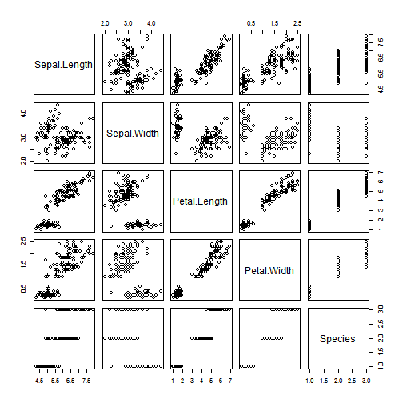

shiny_presentation
========================================================
author: jeffzfw 
date: 2015-6-20

Question
========================================================

A project to Write a shiny application need to be finished.

- Some form of input (widget: textbox, radio button, checkbox, ...)
- Some operation on the ui input in sever.R
- Some reactive output displayed as a result of server calculations
- ...

Plan
========================================================
Decide to using iris dataset to finish this project.

- Iris dataset is very famous dataset.
- Easier to load.
- Faster to deploy.
- ...


Summary of iris dataset
========================================================


```r
summary(iris)
```

```
  Sepal.Length    Sepal.Width     Petal.Length    Petal.Width   
 Min.   :4.300   Min.   :2.000   Min.   :1.000   Min.   :0.100  
 1st Qu.:5.100   1st Qu.:2.800   1st Qu.:1.600   1st Qu.:0.300  
 Median :5.800   Median :3.000   Median :4.350   Median :1.300  
 Mean   :5.843   Mean   :3.057   Mean   :3.758   Mean   :1.199  
 3rd Qu.:6.400   3rd Qu.:3.300   3rd Qu.:5.100   3rd Qu.:1.800  
 Max.   :7.900   Max.   :4.400   Max.   :6.900   Max.   :2.500  
       Species  
 setosa    :50  
 versicolor:50  
 virginica :50  
                
                
                
```

Plot of iris dataset
========================================================

 
<https://jeffzfw.shinyapps.io/data_product>
